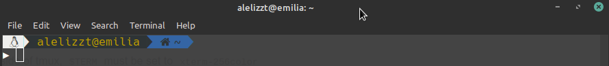
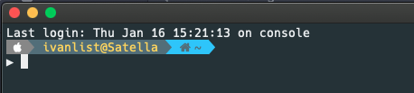

# dotfiles
Mi configuracion de terminal 

Para mostrar los iconos en terminal es necesario la instalacion de la fuente nerdfont, hay 
si prefieren utilizar otra, en lo posible que contenga todos los caracteres.

## Descarga
~~~
git clone https://github.com/Alelizzt/dotfiles.git
cd dotfiles
~~~

## Configuracion de vim
Se da por sentado que ya se tiene instalado vim o neovim

~~~
bash installplugvim.sh
~~~
El script instalara un  a su vez usara el tema 
una vez ejecutado el script, al iniciar vim en su modo normal ejecutar el siguiente comando en caso que no se haya aplicado el tema
~~~
:PLugInstall
~~~

## Instalacion y configuracion de zsh

En cualquier distribucion linux
~~~
bash installzsh.sh
~~~

En mac aun no he probado el script, sin embargo estan los comandos utilizados en el fichero
~~~
installzsh_mac.sh
~~~

     

